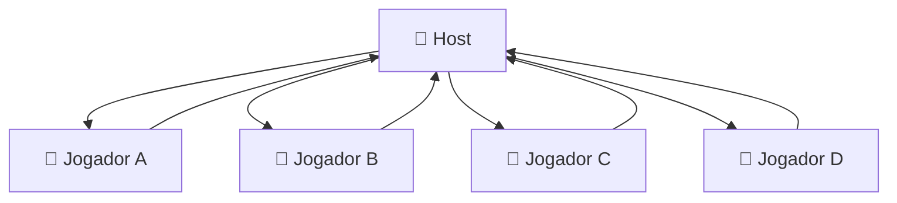
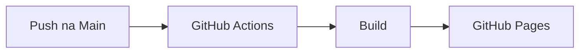

<div align="center">

# 🎹 Allegretto Piano

### Aprenda Piano. Leia Partituras. Jogue. Toque com Amigos.

Uma experiência completa de piano na web que combina **aprendizado musical**, **gamificação**, **partituras interativas**, **visualização em tempo real**, **MIDI** e **multiplayer online**, tudo em uma única aplicação React.

<br>


<br><br>


<br>

### 🎵 18 Músicas • 🎮 4 Modos • 🌐 Multiplayer • 🎹 MIDI

</div>

---

# ✨ O que é o Allegretto?

O **Allegretto Piano** não é apenas um piano virtual.

É uma plataforma que combina:

* 🎹 Piano digital
* 🎼 Leitura de partituras
* 🎯 Treino de precisão
* 🌌 Visualização musical em tempo real
* 🌐 Multiplayer colaborativo
* 🎛️ Integração com teclados MIDI

Tudo funcionando diretamente no navegador.

---

# 🚀 Principais Recursos

<table>
<tr>
<td align="center">

## 📚 Aprender

Aprenda músicas nota por nota.

</td>

<td align="center">

## 🎯 Treino

Jogue no estilo Guitar Hero.

</td>

<td align="center">

## 🎼 Partitura

Leia música de verdade.

</td>
</tr>

<tr>
<td align="center">

## 🌌 Modo Livre

Visualizador musical.

</td>

<td align="center">

## 🌐 Multiplayer

Toque com amigos.

</td>

<td align="center">

## 🎛️ MIDI

Conecte teclados reais.

</td>
</tr>
</table>

---

# 🎮 Modos de Jogo

## 📚 Modo Aprender

Perfeito para iniciantes.

O sistema destaca automaticamente a próxima nota da música e aguarda o jogador tocar.

### Recursos

✅ Sem limite de tempo

✅ Destaque visual da nota correta

✅ Reprodução automática da música

✅ Reinício instantâneo

✅ Ideal para estudo

---

## 🎯 Modo Treino

Transforme o aprendizado em um jogo.

As notas caem pela tela e devem ser tocadas no momento exato.

### Sistema de Pontuação

| Resultado  | Pontos |
| ---------- | ------ |
| ⭐ Perfeito | 100    |
| 👍 Bom     | 50     |

### Recursos

* Sistema de combo
* Multiplicador até 4x
* Velocidade ajustável
* Feedback visual imediato
* Contagem regressiva
* Estatísticas de desempenho

---

## 🎼 Modo Partitura

Pratique utilizando notação musical tradicional.

### Inclui

* Clave de Sol
* Linhas suplementares
* Sustenidos
* Pontos de aumento
* Rolagem automática
* Validação de tempo

Ideal para quem deseja desenvolver leitura musical real.

---

## 🌌 Modo Livre

Uma experiência visual inspirada em visualizadores modernos de piano.

### Recursos

* Tela dedicada em fullscreen
* Barras animadas em tempo real
* Efeitos visuais por nota
* Contador de uso das teclas
* Compatível com multiplayer
* Funciona mesmo com a aba em segundo plano

Cada nota cria uma barra luminosa que cresce enquanto permanece pressionada.

---

# 🌐 Multiplayer em Tempo Real

Toque junto com outras pessoas utilizando WebRTC.

Sem streaming de áudio.

Sem servidores de som.

Apenas eventos musicais extremamente leves.

---

## Recursos Multiplayer

### 👥 Salas Privadas

Crie ou entre em salas usando um código.

### 🎨 Cores Personalizadas

Cada participante possui sua própria identidade visual.

### 🔊 Áudio Local

O som é gerado localmente para máxima performance.

### ⚡ Arquitetura Host Relay



Resultado:

✅ Menor uso de banda

✅ Menor latência

✅ Sem servidor dedicado

---

# 🎼 Biblioteca Musical

O Allegretto acompanha uma coleção de músicas prontas para prática.

### Cada música inclui

* BPM configurado
* Dificuldade
* Sequência de notas estruturada
* Compatibilidade com todos os modos

Atualmente:

## 🎵 18 músicas inclusas

---

# 🎹 Piano Virtual

O instrumento principal possui:

### Recursos

* 25 teclas (C4 → C6)
* Teclas brancas e pretas
* Mouse
* Touch
* Teclado do computador
* MIDI
* Síntese polifônica
* Controle de volume
* Rótulos em Português e Inglês

---

# 🎛️ Suporte a MIDI

Conecte qualquer dispositivo compatível diretamente ao navegador.

### Compatível com

✅ Teclados MIDI

✅ Controladores MIDI

✅ Dispositivos USB MIDI

### Tecnologia

```text
Web MIDI API
```

---

# 🏗️ Arquitetura

O projeto foi construído com uma filosofia incomum:

### Tudo em um único componente React

```text
src/
 ├── PianoMidi.jsx
 └── index.css
```

---

## Filosofia

Ao invés de espalhar lógica por dezenas de arquivos, toda a aplicação foi centralizada em um único componente.

```text
PianoMidi.jsx

≈ 2.150 linhas
≈ Aplicação completa
```

Isso torna o projeto extremamente portátil, fácil de estudar e simples de distribuir.

---

# ⚙️ Tecnologias

| Tecnologia   | Função      |
| ------------ | ----------- |
| React 18     | Interface   |
| Vite         | Build       |
| Tone.js      | Áudio       |
| PeerJS       | Multiplayer |
| WebRTC       | Comunicação |
| TailwindCSS  | Estilização |
| Lucide React | Ícones      |

---

# 📦 Instalação

```bash
npm install
```

---

# 💻 Desenvolvimento

```bash
npm run dev
```

Acesse:

```text
http://localhost:5173
```

---

# 🚀 Build de Produção

```bash
npm run build
```

---

# ☁️ Deploy Automático

Toda alteração enviada para a branch principal gera um novo deploy automaticamente.



---

# 🎵 Motor de Áudio

O sistema utiliza Tone.js para síntese sonora em tempo real.

### Componentes

* PolySynth
* Reverb
* Trigger em tempo real
* Integração MIDI
* Síntese polifônica

Cada participante do multiplayer recebe seu próprio sintetizador local.

---

# 📈 Evolução do Projeto

## 🚀 v1

* Piano Virtual
* MIDI
* Aprender
* Treino
* Partitura
* Multiplayer Básico

---

## 🎨 v2

* Modo Livre
* Cores personalizadas
* Teclas coloridas no multiplayer
* Sincronização de cores

---

## 🌌 v3

* Modo Livre Fullscreen
* Barras estilo Pianoverse
* Sistema visual avançado
* Multiplayer visual em tempo real

---

# 🌟 Destaques

### 🎹 Educação Musical

Aprenda piano de forma intuitiva.

### 🎮 Gamificação

Transforme prática em diversão.

### 🎼 Leitura Musical

Desenvolva habilidades reais de partitura.

### 🌐 Colaboração

Toque junto com amigos de qualquer lugar.

### 🎛️ Hardware Real

Compatível com instrumentos MIDI.

---

<div align="center">

# 🎹 Allegretto Piano

### Aprender música nunca foi tão divertido.

Feito com ❤️ usando React, Tone.js, Web MIDI e WebRTC.

⭐ Se gostou do projeto, deixe uma estrela.

</div>
